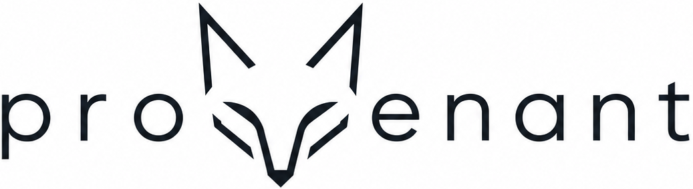

<p align="center">
  
</p>

<h1 align="center">Provenant</h1>

<p align="center">
  <strong>Your coding agent does not need more context. It needs better context.</strong>
</p>

<p align="center">
  Local codebase memory for AI coding agents: cited retrieval, generated wiki pages,
  symbol context, git archaeology, dead-code signals, and risk-aware answers through MCP.
</p>

<p align="center">
  Evaluated on SWE-bench Verified: <strong>63.8% File Coverage@5</strong>,
  <strong>75.2% File Coverage@10</strong> with full retrieval, and
  <strong>60-65x lower context size</strong> versus naive file loading.
</p>

<p align="center">
  <a href="https://pypi.org/project/provenant/"></a>
  
  
  
  <a href="https://github.com/shreyash-sharma/provenant"></a>
</p>

<p align="center">
  <a href="#provenant"><strong>Intro</strong></a>
  &nbsp;|&nbsp;
  <a href="#quickstart"><strong>Quickstart</strong></a>
  &nbsp;|&nbsp;
  <a href="#evaluation"><strong>Evaluation</strong></a>
  &nbsp;|&nbsp;
  <a href="#mcp-tools"><strong>MCP tools</strong></a>
  &nbsp;|&nbsp;
  <a href="https://www.shreyashsharma.com/writing/provenant"><strong>Whitepaper</strong></a>
</p>

---

## 👋 Provenant

Provenant is a Command Line Interface (CLI) and MCP server designed to give AI coding agents a local memory layer for your repository. Integrate Provenant into Claude Code, Cursor, Windsurf, Cline, Copilot, or any MCP-compatible agent to retrieve focused, cited codebase context instead of repeatedly loading raw files.

Provenant reads your codebase, builds generated wiki pages, tracks symbols and dependencies, extracts git history, scores risky files, detects dead code, and exposes all of it through agent-friendly tools. It runs locally against your existing Git repository and stores its index in `.provenant/`.

Using a codebase memory layer for coding agents offers a range of benefits:

- **Lower token waste:** Give agents compact wiki context instead of thousands of raw source tokens.
- **Faster file localization:** Help agents find the files that matter before they start editing.
- **Grounded answers:** Return cited context so claims can be traced back to repository evidence.
- **Safer changes:** Surface risk, dependency centrality, dead-code signals, and likely blast radius.
- **Architectural memory:** Answer "why does this code exist?" using git history and decision context.
- **Self-improving retrieval:** Low-confidence answers can trigger background wiki repair.
- **Editor portability:** Use the same memory layer from any MCP-compatible coding agent.

## 🧭 The Problem

AI coding agents waste context. They search, open, and re-read raw files until they stumble into the right part of the repo. That works on small projects. It breaks down when the system has history, hidden dependencies, stale code, risky modules, and architectural decisions buried across commits.

Provenant builds a local codebase intelligence layer before the agent starts guessing.

It turns your repository into searchable, cited memory: generated wiki pages, dependency structure, symbol-level context, git archaeology, dead-code signals, risk scoring, and repairable retrieval indexes. Your agent asks Provenant for focused context instead of dragging raw file sprawl into every prompt.

<table>
  <tr>
    <td><strong>⚡ Context efficiency</strong><br/>60-65x lower context size versus naive file loading on Flask/Django QA workloads.</td>
    <td><strong>🎯 Better file localization</strong><br/>63.8% File Coverage@5 on SWE-bench Verified with wiki BM25 retrieval.</td>
    <td><strong>📎 Grounded answers</strong><br/>Responses cite retrieved pages and report attribution confidence.</td>
  </tr>
  <tr>
    <td><strong>🛠️ Self-healing retrieval</strong><br/>Low-confidence answers trigger background wiki repair without blocking the agent.</td>
    <td><strong>🔒 Local by default</strong><br/>Indexes live in <code>.provenant/</code>. Bring your own model keys or local providers.</td>
    <td><strong>🔌 MCP-native</strong><br/>Eight tools for Claude Code, Cursor, Windsurf, Cline, and other MCP-compatible clients.</td>
  </tr>
</table>

## ⚡ Quickstart

```bash
pip install provenant
```

```bash
provenant init ./myrepo        # index repo, generate wiki, build retrieval state
provenant serve ./myrepo       # MCP server + local web dashboard
```

Ask from the CLI:

```bash
provenant ask "how does auth work?" --path ./myrepo
provenant costs ./myrepo
```

Use from an MCP client:

```json
{
  "mcpServers": {
    "provenant": {
      "command": "provenant",
      "args": ["serve", "/path/to/repo"]
    }
  }
}
```

## 📊 Evaluation

Provenant was evaluated on **SWE-bench Verified**: 500 real GitHub issues across 12 Python repositories.

| Result | Baseline | Provenant | Delta |
|---|---:|---:|---:|
| File Coverage@5 | 56.2% raw BM25 | **63.8%** wiki BM25 | **+7.6 pp** |
| File Coverage@5, full config | 56.2% raw BM25 | **66.2%** reranker + selective HyDE | **+10.0 pp** |
| File Coverage@10, full config | 69.0% raw BM25 | **75.2%** | **+6.2 pp** |
| MRR, full config | 0.404 raw BM25 | **0.454** | **+0.050** |
| Context size | naive file loading | **60-65x lower** | measured on Flask/Django QA |
| Answer quality | baseline | parity | **-0.15/5** average delta |
| Low-confidence repair | 4 low-confidence queries | **2 improved** | avg judge **4.50 -> 4.75** |
| Repair cost | - | **~$0.02** | 10 pages repaired / 1,393 |

File Coverage@5 means the correct issue-relevant file appears in the top 5 retrieved results. File Coverage@10 uses the top 10. MRR is mean reciprocal rank.

Evidence trail:

- [Evaluation summary](EVALUATION.md)
- [Benchmark artifacts](benchmarks/)
- [Read the whitepaper](https://www.shreyashsharma.com/writing/provenant)

A longer research manuscript is currently under submission.

## 🧠 How It Works

```text
repo
  -> tree-sitter parse
  -> symbol + import graph
  -> generated wiki pages
  -> BM25 / vector / HyDE retrieval
  -> cited MCP answers
  -> confidence-gated repair
```

| Stage | What Provenant builds | Why agents care |
|---|---|---|
| Parse | File graph, symbol graph, imports, inheritance, entry points | The agent sees structure before opening files. |
| Explain | Plain-English wiki pages for files and modules | Natural-language questions match prose better than syntax. |
| Retrieve | BM25, optional vector search, selective HyDE, reranking | The agent gets the right code area with fewer tokens. |
| Ground | Citations, confidence, source-linked context | Answers are inspectable instead of free-floating. |
| Repair | Background rewrites for low-confidence pages | Retrieval improves as the repo is used. |

## 🔌 MCP Tools

| Tool | Use it for |
|---|---|
| `provenant_ask` | Hybrid BM25 + HyDE retrieval with cited answers and confidence scores. |
| `provenant_context` | File, module, and symbol triage cards: purpose, API, relationships, freshness. |
| `provenant_search` | Semantic search over generated wiki content. |
| `provenant_overview` | Architecture summary, entry points, dependency structure, and repo map. |
| `provenant_symbol` | Byte-precise source retrieval for a specific function, class, or method. |
| `provenant_dead_code` | Unreachable code with confidence tiers and safe-to-delete flags. |
| `provenant_risk` | Hotspot scores, change frequency, test coverage gaps, and blast radius. |
| `provenant_why` | Git archaeology: blame, commit history, and architectural decisions. |

## 🧰 What You Get

### Codebase wiki

`provenant init` parses your repo with tree-sitter across 15+ languages and generates plain-English wiki pages for every file: purpose, public API, key functions, relationships, and implementation notes. The wiki is stored locally in `.provenant/`.

### Attribution confidence

Every answer computes `confidence = cited pages / retrieved pages`. Low confidence is a signal that the wiki or retrieval index should be improved. Provenant uses that signal for repair instead of blindly trusting the first answer.

### Self-healing index

Low-confidence answers can trigger background wiki repair. Agents do not wait on repair, and confidence-gated rewrites prevent uncontrolled churn. In the Django repair study, 2 of 4 low-confidence queries improved, average judge score moved from 4.50 to 4.75, and only 10 of 1,393 pages needed rewriting at about $0.02.

### Dependency and risk graph

Provenant extracts file nodes, symbol nodes, imports, inheritance, mixins, and trait impls where supported. PageRank and betweenness centrality identify central code; risk scoring combines change frequency, dependency centrality, and test coverage gaps.

### Dead-code analysis

Find unreachable functions, classes, and modules. Findings are grouped by confidence tier and marked safe-to-delete when Provenant can avoid dynamic-call ambiguity.

### Git archaeology

`provenant_why` traces why code exists: git blame, related commits, and architectural decisions linked to the files your agent is editing.

## 🖥️ Web Dashboard

```bash
provenant serve ./myrepo
```

The local dashboard visualizes wiki pages, graph structure, dead-code findings, risk scores, repair candidates, and retrieval state. It is useful when you want to inspect the same memory layer your agent is querying.

## 🧩 Monorepos

```bash
provenant init ./my-project
# Detected 3 repositories:
#   backend/     Django
#   frontend/    React/TypeScript
#   mobile/      React Native
```

Each sub-repo gets its own wiki. Cross-repo context is linked so frontend questions can surface backend files and backend questions can surface client usage.

## ⚙️ Configuration

Set one LLM provider for wiki generation and answer synthesis:

```bash
ANTHROPIC_API_KEY=...
OPENAI_API_KEY=...
DEEPSEEK_API_KEY=...
GEMINI_API_KEY=...
```

Choose an embedder:

```bash
provenant init ./myrepo --embedder local     # free, small local model, no API key
provenant init ./myrepo --embedder openai    # hosted embeddings, stronger retrieval
```

Optional embedding settings:

```bash
OPENAI_EMBEDDING_API_KEY=...
OPENAI_EMBEDDING_MODEL=nomic-embed-text-v1.5
OPENAI_EMBEDDING_BASE_URL=https://api.fireworks.ai/inference/v1
```

Provenant is self-hostable and has no product telemetry. Repository indexes stay local; only the configured LLM or embedding calls leave your machine.

## ✅ When To Use Provenant

Use Provenant when:

- Your agent keeps opening too many files before making progress.
- The repo is old enough that "why does this exist?" matters.
- You need cited answers instead of plausible summaries.
- Risk, dead code, and dependency structure matter before edits.
- You want MCP tools that work across editors instead of a single-agent plugin.

## 📄 License

MIT
